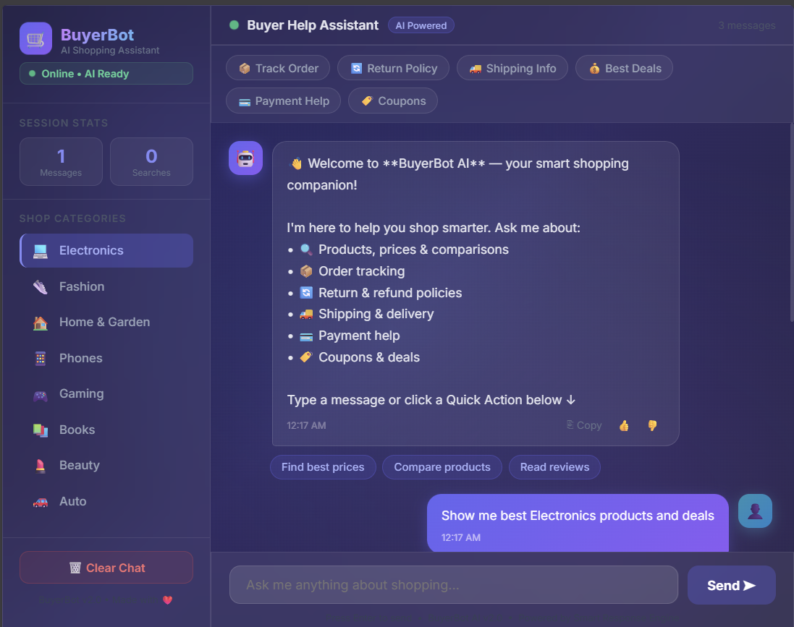
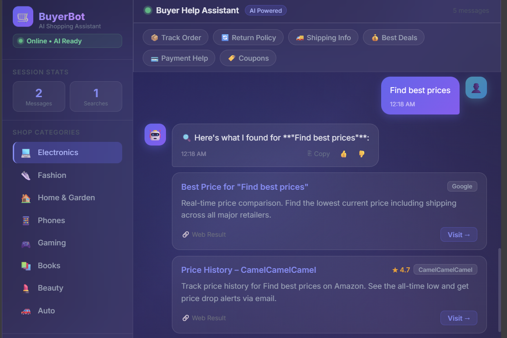

<div align="center">

# 🛒 BuyerBot AI

### AI-Powered Smart Shopping Assistant

[](https://reactjs.org)
[](https://vitejs.dev)
[](https://developer.mozilla.org/en-US/docs/Web/JavaScript)
[](LICENSE)

**BuyerBot** helps shoppers get instant answers about products, prices, order tracking, return policies, shipping info, and deals — all in a beautiful AI-styled chat interface.

[🚀 Quick Start](#-quick-start) • [✨ Features](#-features) • [📁 Project Structure](#-project-structure) • [🛠️ Tech Stack](#-tech-stack)

</div>

---

## 📸 Screenshots

> **Note:** Add your screenshots to `docs/screenshots/` and update the paths below.

| Dashboard Overview | Chat in Action |
|---|---|
|  |  |

> To add screenshots: take a screenshot of `dashboard.html` in your browser, save to `docs/screenshots/`, then update the image paths above.

---

## ✨ Features

### 🤖 Smart AI Responses
- **Order Tracking** — step-by-step carrier guidance (FedEx, UPS, USPS, DHL)
- **Return & Refund Policies** — instant lookup for Amazon, Walmart, Best Buy, Target, eBay
- **Shipping Estimations** — delivery times and free shipping tips
- **Payment Help** — declined cards, dispute guidance, safe shopping tips
- **Deal Finder** — coupon extensions, price history, cashback sites
- **Product Comparison** — tools and methodology to compare purchases

### 🎨 Beautiful Dark UI
- Glassmorphism design with animated mesh background
- Gradient text and avatar effects
- Smooth fade-up message animations
- Floating logo with glow effect

### 💬 Interactive Chat
- **Quick Action buttons** — 6 one-click shortcuts
- **Suggestion chips** — smart follow-up questions after each response
- **👍 / 👎 Reactions** — rate bot responses
- **⎘ Copy button** — copy any message to clipboard
- **Typing animation** — gradient bouncing dots indicator
- **Shimmer search bar** — visual feedback while searching

### 📊 Sidebar
- 8 **Shop Categories** (Electronics, Fashion, Gaming, etc.) with auto-search
- **Session stats** — messages and searches counter
- **Clear Chat** button

### 🔗 Web Search Results
- Clickable result cards with source badges
- ★ Star ratings on trusted sources
- Direct "Visit →" links to product pages

### ⚡ Standalone Mode
- **`dashboard.html`** works directly in browser — no Node/npm needed
- Uses React 18 + Babel from CDN

---

## 🚀 Quick Start

### Option A — Open directly (no setup needed)
```
Double-click: dashboard.html
```
Requires internet (CDN). No installation.

---

### Option B — Run with Vite dev server

**Prerequisites:** Node.js 18+

```bash
# 1. Clone the repo
git clone https://github.com/YOUR_USERNAME/BuyerHelpChatbot.git
cd BuyerHelpChatbot

# 2. Install dependencies
npm install

# 3. Start dev server
npm run dev
```

Open [http://localhost:5173](http://localhost:5173) in your browser.

```bash
# Build for production
npm run build

# Preview production build
npm run preview
```

---

## 📁 Project Structure

```
BuyerHelpChatbot/
├── src/
│   ├── components/
│   │   ├── MessageBubble.jsx   # Chat bubbles, reactions, copy, suggestion chips
│   │   └── Sidebar.jsx         # Categories, stats, clear chat
│   ├── data/
│   │   └── botData.js          # Bot knowledge base, web search, constants
│   ├── App.jsx                 # Main app — layout, state, message flow
│   ├── main.jsx                # React entry point
│   └── index.css               # Global styles, animations, CSS variables
├── docs/
│   └── screenshots/            # UI screenshots for README
├── public/
│   └── vite.svg
├── dashboard.html              # Standalone version (CDN, no build needed)
├── index.html                  # Vite entry point
├── vite.config.js
├── package.json
└── .gitignore
```

---

## 🛠️ Tech Stack

| Technology | Version | Purpose |
|---|---|---|
| **React** | 19.x | UI framework |
| **Vite** | 7.x | Build tool & dev server |
| **JavaScript (ESM)** | ES2022+ | Language |
| **CSS** | Custom variables + keyframes | Styling & animations |
| **Inter** | Google Fonts | Typography |

---

## 🧩 Component Overview

| Component | File | Description |
|---|---|---|
| `App` | `src/App.jsx` | Root — state management, layout, message flow |
| `Sidebar` | `src/components/Sidebar.jsx` | Category nav, session stats, clear chat |
| `MessageBubble` | `src/components/MessageBubble.jsx` | User/bot bubbles, reactions, copy |
| `SearchResultCard` | `src/components/MessageBubble.jsx` | Web result cards with links |
| `SuggestionChips` | `src/components/MessageBubble.jsx` | Follow-up question pills |
| Bot Knowledge | `src/data/botData.js` | Response logic, web search simulation |

---

## 🗺️ Roadmap

- [ ] Real AI integration (Gemini / OpenAI API)
- [ ] Real web search via API (SerpAPI / Tavily)
- [ ] Chat history persistence (localStorage)
- [ ] Dark / Light mode toggle
- [ ] Mobile responsive layout
- [ ] Price alert notifications
- [ ] Multi-language support

---

## 🤝 Contributing

Pull requests are welcome! For major changes, please open an issue first.

1. Fork the repo
2. Create your feature branch: `git checkout -b feat/amazing-feature`
3. Commit your changes: `git commit -m 'feat: add amazing feature'`
4. Push to the branch: `git push origin feat/amazing-feature`
5. Open a Pull Request

---

## 📄 License

ISC © 2025 — Made with ❤️ for smart shoppers
